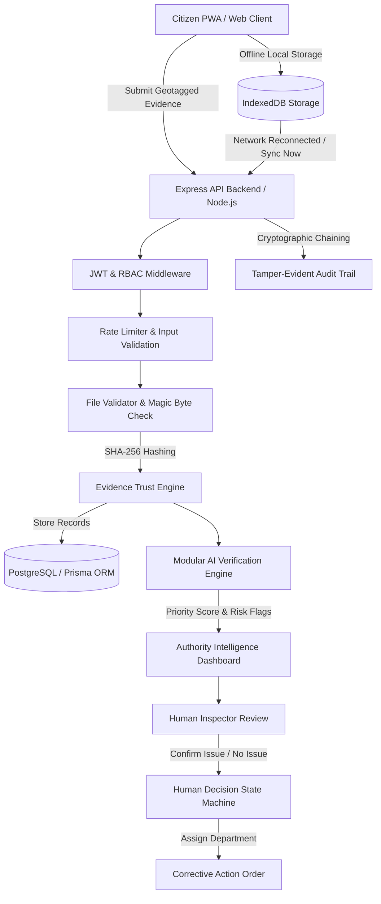

# MAKKALSAANTRU (மக்கள் சான்று)

> **"Public Money. Public Work. Public Proof."**
> **Subtitle**: *Citizen-Powered • AI-Assisted • Human-Verified*

MakkalSaantru is a citizen-powered, AI-assisted public-work verification platform. The platform empowers citizens to corroborate public infrastructure milestone progress (**25%, 50%, 75%, 100%**) while projects are actively under execution.

> ⚠️ **IMPORTANT GOVERNING PRINCIPLE**:
> MakkalSaantru is **NOT a corruption detection system** and **NOT a simple complaint portal**. AI assists solely by analyzing evidence patterns, inconsistencies, and risk indicators. **Final administrative decisions strictly remain with authorized human inspection officials.**

---

## 🎯 1. Problem Statement

Public infrastructure projects in developing regions often suffer from information asymmetry between officially reported progress and actual ground reality. By the time a project reaches 100% completion status or funds are fully disbursed, identifying missing milestones, unpaved stretches, or substandard quality becomes costly and difficult to rectify.

---

## 💡 2. Proposed Solution & Resource Intelligence

MakkalSaantru introduces **Resource Intelligence**:
Instead of waiting for project completion, citizens submit ground evidence (photos, voice notes, GPS coordinates) at intermediate milestones (**25%, 50%, 75%**).

1. **Early Intervention**: If a mismatch is flagged at 50% progress, authorities dispatch an official inspector, confirm the issue, issue a **Corrective Action Order**, and protect public resources *while work is actively underway*.
2. **Urgency / Priority Engine**: Calculates a 0–100 **ACTION PRIORITY SCORE** from system signals (report count, confirmations, age, category weight) to rank operational review attention.
3. **Before → After Resolution Proof**: Cryptographically validates corrective action photos (SHA-256 digests), compares visual state, and requires human & citizen re-verification to mark cases resolved.
4. **Civic Intelligence Heatmap**: Map-based intelligence dashboard (`/authority/civic-map`) visualizing report concentration, 250m radius hotspot detection, area intelligence aggregation, and recurring location signals.
5. **Cross-Department Case Detection**: Automatically detects multi-domain civic problems (`WATER_SUPPLY` + `ROAD`, `DRAINAGE` + `ROAD`, `SEWAGE` + `ROAD`, `SANITATION` + `DRAINAGE`) from ONE citizen report, maintaining a non-accusatory safety policy and creating sequential action dependency plans.

```
25% MILESTONE → 50% MILESTONE (Early Warning Flagged) → ACTION PRIORITY QUEUE → CROSS-DEPARTMENT DETECTION → CIVIC HEATMAP → REMEDIAL ACTION → BEFORE/AFTER PROOF → RESOLVED
```


---

## 🏛️ 3. Architecture & System Flow



---

## 🔒 4. Cybersecurity Architecture


---

## 📱 5. Citizen Experience & Accessibility

- **Verification Wizard**: Step-by-step indicator (`1. PROJECT` → `2. EVIDENCE` → `3. LOCATION` → `4. QUESTIONS` → `5. REVIEW` → `6. SUBMIT`).
- **Offline-First PWA**: Service Worker caching, IndexedDB offline report storage, and automatic/manual `SYNC NOW` sync engine.
- **Accessibility & Language**:
  - Tamil (`தமிழ்`) and English bilingual support.
  - Text-to-Speech (TTS) spoken guidance.
  - Voice-friendly Simple Mode toggle with high contrast and large buttons.
  - Browser audio dictation for hands-free notes.

---

## 🤖 6. AI-Assisted Verification Engine

- **Principle**: *AI FLAGS — HUMANS DECIDE*.
- **Outputs**: Strictly constrained to JSON schema (`CONSISTENT`, `REVIEW`, `POTENTIAL_MISMATCH`).
- **Inputs**: Multi-citizen corroboration, distance to project coordinates, milestone match ratio, duplicate image discounting, and AI Vision (Gemini / vendor-independent mock).

---

## 🛡️ 7. Cybersecurity Hardening

1. **Password Security**: Passwords hashed with `bcrypt` (work factor 10). Password strength requirement (min 8 chars, 1 letter, 1 number). `passwordHash` omitted from API responses.
2. **JWT Security**: Signed via HMAC SHA-256 with `JWT_SECRET` and 24h expiration.
3. **RBAC & Anti-IDOR**: Server middleware enforces role permissions (`CITIZEN`, `INSPECTOR`, `ADMIN`) and evidence ownership (`userId === req.user.id`).
4. **Binary Magic-Byte Upload Defense**: `fileValidator.ts` checks binary signatures (`FF D8 FF` for JPEG, `89 50 4E 47` for PNG, `52 49 46 46` for WEBP/WAV) to reject disguised executables (`.sh`, `.php`).
5. **Security Event Monitoring**: Active `/admin/security` dashboard tracking real events (`FAILED_LOGIN`, `LOGIN_RATE_LIMITED`, `ACCESS_DENIED`, `INVALID_TOKEN`, `INVALID_UPLOAD`, `INTEGRITY_MISMATCH`).
6. **Secrets Management**: Repository verified clean using `node scripts/scanSecrets.js`.

---

## 💻 8. Technology Stack

- **Frontend**: React 18, Vite, TypeScript, PWA Manifest & Service Worker, IndexedDB Storage, Web Speech API, MediaRecorder API, Lucide React Icons.
- **Backend**: Node.js, Express, TypeScript, Multer, Helmet, CORS, Express Rate Limit, Zod.
- **Database & ORM**: PostgreSQL & Prisma ORM + API in-memory fallback.
- **Testing**: Jest, Supertest.

---

## 🔑 9. Demo Accounts & Credentials

| Role | Email | Password | Access Workspace |
|---|---|---|---|
| **CITIZEN** | `citizen@makkalsaantru.gov.in` | `citizen123` | `/citizen` |
| **INSPECTOR** | `inspector@makkalsaantru.gov.in` | `inspector123` | `/authority` |
| **ADMINISTRATOR** | `admin@makkalsaantru.gov.in` | `admin123` | `/admin/security` |

---

## 🚀 10. Installation & Setup

### Prerequisites
- Node.js (v18+) & npm

### Installation Commands
```bash
# 1. Install dependencies across monorepo
npm run install:all

# 2. Seed demo dataset (Safe fictional data)
npm run seed:demo

# 3. Run secret scanning script
npm run scan:secrets

# 4. Run automated test suite (43 tests passing)
npm test

# 5. Start development servers (Backend: 5005, Frontend: 5173)
npm run dev:server
npm run dev:client
```

---

---

## 🏛️ 10. Civic Issue Reporting Module

MakkalSaantru now features a complete **Report a Civic Issue** module designed so ordinary citizens can report civic problems without knowing responsible government departments:

- **6-Step Mobile-First Wizard** (`/citizen/report`): Photo Capture → Geotagged Location → AI Issue Identification → Citizen Confirmation → Formal Complaint Generation → Review & Export.
- **9 Supported Civic Domains**: `ROAD`, `SANITATION`, `WATER_SUPPLY`, `DRAINAGE`, `STREETLIGHT`, `PUBLIC_BUILDING`, `PUBLIC_SPACE`, `SEWAGE`, `OTHER`.
- **Server-Side AI Vision & Heuristic Fallback**: AI vision identifies observable civic issues without making legal accusations or performing facial recognition. Works seamlessly when AI API is unavailable.
- **Configured Authority Routing**: Deterministic matching mapping Category + Location to `AuthorityDirectory` entries. LLM does NOT invent departments.
- **Formal Complaint & PDF Download**: Generates structured complaints with internal `MS-CIV-2026-XXXXX` report codes, SHA-256 evidence fingerprints, and printable PDF exports with `HACKATHON PROTOTYPE` watermarks.

---

## 📄 11. API Summary Table

| Method | Endpoint | Auth Req | Allowed Role | Purpose |
|---|---|---|---|---|
| `GET` | `/api/health` | No | Public | System status |
| `GET` | `/api/system/info` | No | Public | Operational metadata |
| `POST` | `/api/auth/login` | No | Public | Authenticate user & issue JWT |
| `GET` | `/api/projects` | No | Public | List public projects |
| `POST` | `/api/projects/:id/evidence` | Yes | CITIZEN | Submit geotagged evidence |
| `POST` | `/api/verifications/project/:id/analyze` | Yes | INSPECTOR/ADMIN | Run AI verification analysis |
| `GET` | `/api/authority/dashboard` | Yes | INSPECTOR/ADMIN | Authority intelligence dashboard |
| `POST` | `/api/authority/cases/:id/decision` | Yes | INSPECTOR/ADMIN | Record human inspection decision |
| `POST` | `/api/civic-reports/classify` | No | Public | AI-assisted vision & heuristic classification |
| `POST` | `/api/civic-reports/route-authority` | No | Public | Deterministic category + location authority routing |
| `POST` | `/api/civic-reports/generate-complaint` | No | Public | Generate formal structured neutral complaint text |
| `POST` | `/api/civic-reports` | Yes | CITIZEN | Submit geotagged civic issue report |
| `GET` | `/api/civic-reports/my-reports` | Yes | CITIZEN | List citizen's civic report history |
| `GET` | `/api/civic-reports/all` | Yes | INSPECTOR/ADMIN | View all civic reports across departments |
| `GET` | `/api/authority-directory` | No | Public | Fetch configured authority directory entries |
| `POST` | `/api/admin/authorities` | Yes | ADMIN | Create new authority directory entry |
| `GET` | `/api/admin/security/events` | Yes | ADMIN | Live security event feed |

---

## ⚠️ 12. Known Limitations & Future Scope

### Known Prototype Limitations
- Demonstrates with fictional demo project data. Not connected to live government systems.
- SHA-256 hash proves integrity after receipt on server; GPS signals can be spoofed on client devices.

### Future Scope
- Authorized government API integration.
- Additional Indian regional languages (Hindi, Telugu, Kannada, Malayalam).
- IVR and basic feature-phone reporting bridge.
