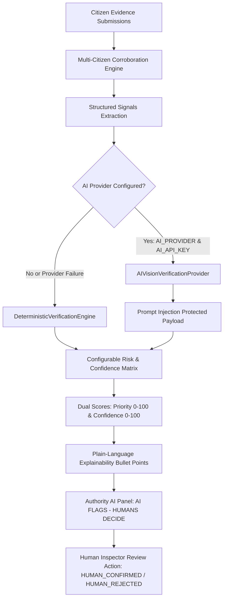

# MakkalSaantru AI-Assisted Verification Engine Architecture

## 1. Purpose & Non-Negotiable Ethics Principles

MakkalSaantru ("Public Money. Public Work. Public Proof.") utilizes AI to identify evidence patterns, inconsistencies, and corroboration metrics to prioritize public infrastructure projects for human inspection.

> **CRITICAL ETHICAL BOUNDARY**:
> **AI FLAGS. HUMANS DECIDE.**
> The system **NEVER** automatically declares `CORRUPTION`, `FRAUD`, `GUILTY`, or `MISAPPROPRIATION`.
> Output categories are strictly:
> - `CONSISTENT` (0–29 Priority Score)
> - `REVIEW` (30–59 Priority Score)
> - `POTENTIAL_MISMATCH` (60–100 Priority Score)

---

## 2. System Architecture & Modular Provider Abstraction

---

## 3. Input Signals & Structured Signal Taxonomy

The engine operates on structured, non-private evidence metrics:

1. **`LOCATION_SIGNAL`**:
   - `NEAR_PROJECT` (Within 250m GPS proximity)
   - `LOCATION_REVIEW` (250m – 1000m)
   - `LOCATION_MISMATCH` (> 1000m)
   - `LOCATION_NOT_PROVIDED`

2. **`INTEGRITY_SIGNAL`**:
   - `VALID` (Server-calculated 64-char SHA-256 hash match)
   - `MISMATCH` / `UNKNOWN`

3. **`DUPLICATE_SIGNAL`**:
   - `UNIQUE`
   - `POSSIBLE_DUPLICATE` (Exact byte hash duplicate detected)

4. **`CITIZEN_PROGRESS_SIGNAL`**:
   - `MATCHES_REPORTED_PROGRESS`
   - `DOES_NOT_MATCH_REPORTED_PROGRESS`
   - `UNCERTAIN`

5. **`CORROBORATION_SIGNAL`**:
   - `LOW` (1 citizen)
   - `MEDIUM` (2-4 citizens)
   - `HIGH` (>= 5 independent citizens)

---

## 4. Multi-Citizen Corroboration & Anti-Manipulation

To prevent individual spam or artificial manipulation:
- Evidence is grouped by `projectId` and `milestone`.
- Repeated duplicate submissions from the same user or identical file hashes count as **1 underlying signal + duplicate flag**.
- Independent citizen count relies on **unique authenticated citizen IDs**.

---

## 5. Dual Scoring Methodology

### A. Verification Priority Score (0–100)
Indicates review priority for official human inspectors:
- **0 – 29**: `CONSISTENT` (Routine monitoring)
- **30 – 59**: `REVIEW` (Schedule verification)
- **60 – 100**: `POTENTIAL_MISMATCH` (Prioritize human inspection)

### B. Evidence Confidence Score (0–100)
Measures evidence reliability based on independent citizen volume, location proximity, valid SHA-256 hashes, and low duplicate ratios.

---

## 6. Prompt Injection & Privacy Safeguards

- Citizen comments are treated as **untrusted data** and delimited inside strict tags (`<<< UNTRUSTED_CITIZEN_COMMENT ... >>>`).
- **No Facial Recognition**: Models are strictly instructed never to identify people or infer sensitive personal traits.
- **API Key Security**: `AI_API_KEY` is maintained strictly server-side and never returned in API payloads.

---

## 7. Fallback Architecture

If `AI_API_KEY` is omitted or external API calls fail/timeout:
- System cleanly executes `DeterministicVerificationEngine`.
- Displays: *"AI vision unavailable — using structured evidence analysis."*
- Full application functionality remains 100% operational.
