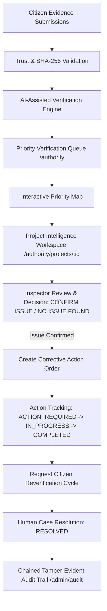

# MakkalSaantru Authority Intelligence Dashboard & Human Verification Workflow

## 1. Overview & Non-Negotiable Core Principle

Phase 6 completes the authority-facing command center for **MAKKALSAANTRU** ("Public Money. Public Work. Public Proof.").

> **CORE PRINCIPLE**:
> **AI FLAGS. HUMANS DECIDE.**
> The AI Verification Engine identifies evidence pattern alerts and prioritizes public projects for human inspection. Authorized human inspection officials conduct site audits, record inspection decisions, issue corrective action orders, and resolve alerts with immutable audit logging.

---

## 2. End-to-End Human-in-the-Loop Architecture



---

## 3. Human Inspection Decision State Machine

The human verification lifecycle follows strict allowed state transitions:

```
HUMAN_REVIEW_PENDING → UNDER_HUMAN_REVIEW → ISSUE_CONFIRMED → RESOLVED
                                         → NO_ISSUE_FOUND → RESOLVED
                                         → MORE_EVIDENCE_REQUIRED → UNDER_HUMAN_REVIEW
```

- **`HUMAN_REVIEW_PENDING`**: Default state when AI engine returns `REVIEW` or `POTENTIAL_MISMATCH`.
- **`UNDER_HUMAN_REVIEW`**: Active site audit initiated by assigned inspector.
- **`ISSUE_CONFIRMED`**: Inspector confirms milestone variance (inspection note/reason strictly required).
- **`NO_ISSUE_FOUND`**: Inspector verifies ground conditions match reported milestone.
- **`MORE_EVIDENCE_REQUIRED`**: Inspector requests secondary evidence or site measurements.
- **`RESOLVED`**: Corrective action completed and verified by human engineer.

---

## 4. Resource Intelligence & Early Intervention

- **Resource Intelligence Panel**: Calculates detection stage (`25% VERY EARLY`, `50% EARLY`, `75% LATE-STAGE`, `100% POST-COMPLETION`) and remaining project progress.
- **Intervention Messaging**: *"Early verification enables authorities to investigate before the project progresses further."*

---

## 5. Security & RBAC Enforcement

- **Role Protections**: Sensitive authority endpoints (`POST /api/authority/cases/:id/decision`, `POST /api/authority/cases/:id/actions`, `GET /api/admin/audit`) are strictly protected by `requireRole(['INSPECTOR', 'ADMIN'])` or `requireRole(['ADMIN'])`.
- **IDOR Protection**: Citizens attempting to access inspector dashboards receive `HTTP 403 Forbidden`.
- **Sanitized Auditing**: Passwords, API keys, and secret tokens are strictly excluded from audit logs.
