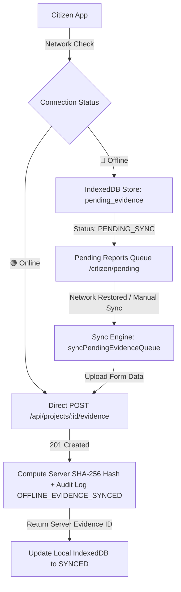

# MakkalSaantru Offline-First & Accessibility Architecture

## 1. Executive Summary

MakkalSaantru ("Public Money. Public Work. Public Proof.") is designed for high reliability in remote, rural, low-connectivity, and low-literacy environments across Tamil Nadu.

Phase 4 establishes an **Offline-First Storage Engine** combined with **Voice-Friendly Accessibility (TTS + Voice Dictation)** to ensure citizens can inspect public projects, record photo and voice ground evidence without connectivity, and sync seamlessly once network access returns.

---

## 2. Technical Architecture & Component Flow

---

## 3. Data Integrity & Trust Security Guarantees

1. **No Fake Evidence IDs while Offline**:
   - Offline items are assigned local client UUIDs (`pending-172...`) with status `syncStatus: "PENDING_SYNC"`.
   - Official server Evidence IDs (`EV-...`) and SHA-256 hashes are strictly generated on the backend server upon transmission.

2. **No Secret or Plaintext Password Storage**:
   - IndexedDB stores only public project data (`cached_projects`) and draft blobs (`pending_evidence`).
   - Plaintext passwords or sensitive credentials are **never** cached locally.

3. **Cryptographic Chained Audit Logging**:
   - When offline reports are uploaded to `/api/projects/:id/evidence`, the server validates `clientCapturedAt` timestamp and records an immutable chained audit log with action `OFFLINE_EVIDENCE_SYNCED`.

4. **Low Data / Bandwidth Compression**:
   - Client-side canvas quality compressor reduces photo payload sizes before local storage and network upload when Low Data Mode is active.

---

## 4. Voice-Friendly Accessibility & Regional Language Support

1. **Text-to-Speech (TTS)**:
   - Built-in Browser `window.speechSynthesis` provides voice guidance for all verification steps.
   - Fully supports both **English** (`en-IN` / `en-US`) and **Tamil** (`ta-IN`).

2. **Regional Localization (i18n)**:
   - Translation keys stored in `client/src/locales/en.json` and `ta.json`.
   - On-the-fly UI switching between English and Tamil (தமிழ்).

3. **Speech Recognition Voice Dictation**:
   - Web Speech API integration (`webkitSpeechRecognition` / `SpeechRecognition`) allows citizens to speak notes directly in their native language.
