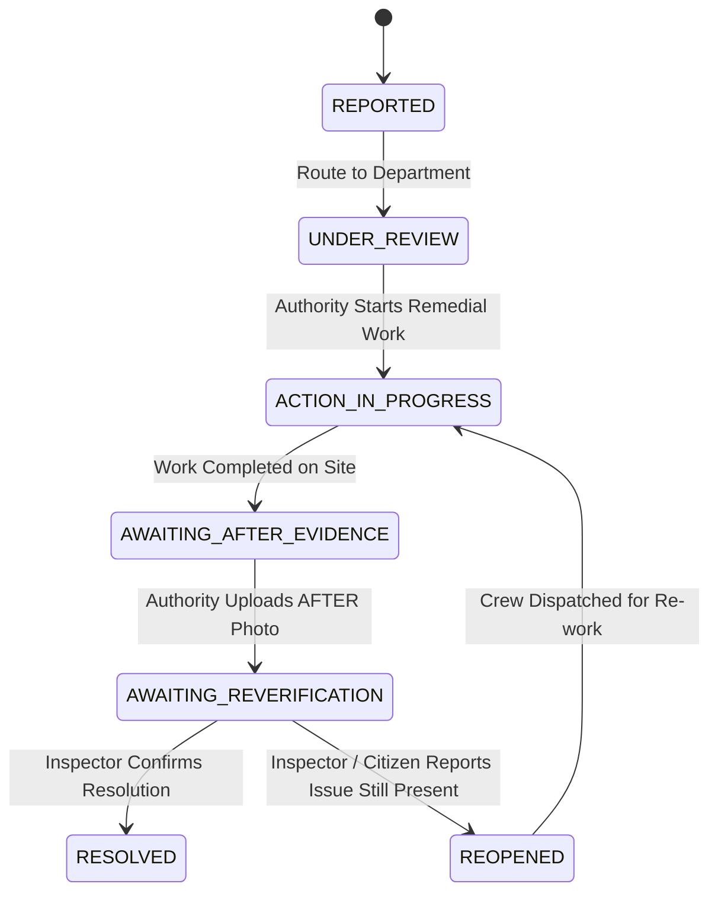

# MakkalSaantru — Before → After Resolution Proof Specification

## Overview & Purpose

The **Before → After Resolution Proof** module provides end-to-end cryptographic and visual verification for civic issue resolution. It ensures that when a department claims a civic issue (e.g., road pothole, garbage pile, water leak) has been fixed, verifiable evidence is recorded, hashed, compared, and audited by both human inspectors and citizens.

---

## 1. Lifecycle State Machine



---

## 2. Before vs. After Cryptographic Evidence

| Stage | Evidence Item | Cryptographic Validation | Purpose |
| :--- | :--- | :--- | :--- |
| **BEFORE** | Original citizen photo | SHA-256 Digest & Geotag | Preserves original ground truth of problem |
| **AFTER** | Authority repair photo | Server-side SHA-256 Digest & Magic-Byte check | Verifies authentic photo upload by authority |

Both hashes are displayed on the public **Resolution Proof Card**:

```text
SHA-256 (BEFORE): a1b2c3d4e5f678901234567890abcdefa1b2c3d4e5f678901234567890abcdef
SHA-256 (AFTER) : e5f678901234567890abcdefa1b2c3d4e5f678901234567890abcdefa1b2c3d4
```

---

## 3. Vision AI Comparison (Human-in-the-Loop)

When an AFTER photo is uploaded, `ResolutionComparisonService` performs an automated advisory comparison:

- `POSSIBLY_RESOLVED`: Surface features indicate repair completion (e.g., asphalt patch laid over pothole).
- `POSSIBLY_UNRESOLVED`: Obstruction or defect pattern remains visible.
- `UNCERTAIN`: Lighting or angle prevents conclusive automated match.

> [!WARNING]
> **AI Does NOT Set Status**: The AI observation is **strictly advisory**. The status can **ONLY** be moved to `RESOLVED` or `REOPENED` by a **Human Inspector Verdict** or **Citizen Re-verification Feedback**.

---

## 4. Human & Citizen Re-verification Workflows

### A. Human Inspector Site Audit
Inspectors record official site audit findings:
- `RESOLUTION_CONFIRMED` $\rightarrow$ Transitions status to `RESOLVED`.
- `ISSUE_STILL_PRESENT` $\rightarrow$ Transitions status to `REOPENED`.
- `MORE_EVIDENCE_REQUIRED` $\rightarrow$ Requests updated photo.

### B. Citizen Re-verification Feedback
Reporting citizens can confirm or dispute resolution on ground:
- `APPEARS_RESOLVED` $\rightarrow$ Confirms closure.
- `STILL_PRESENT` $\rightarrow$ Triggers automated status transition to `REOPENED` with alert to department head.

---

## 5. Pre-seeded Demo Cases for Judges

The system includes pre-seeded judge demo cases:

1. **Demo Case 1 (`MS-CIV-2026-00124`)**: Road Pothole in Trichy Junction
   - Action Priority Score: **84 (URGENT REVIEW)**
   - Remedial Action: Bitumen resurfacing completed.
   - Status: `RESOLVED` with SHA-256 Before/After proof.
2. **Demo Case 2 (`MS-CIV-2026-00125`)**: Garbage Accumulation in Ward 12
   - Action Priority Score: **62 (HIGH)**
   - Remedial Action: Partial waste clearance.
   - Status: `REOPENED` (Citizen reported remaining waste).
